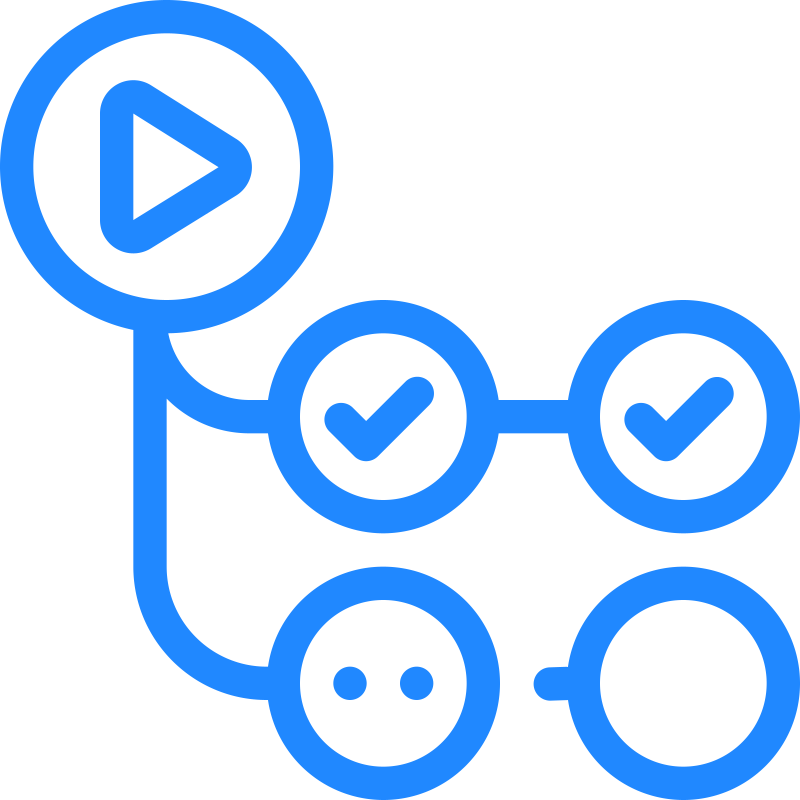
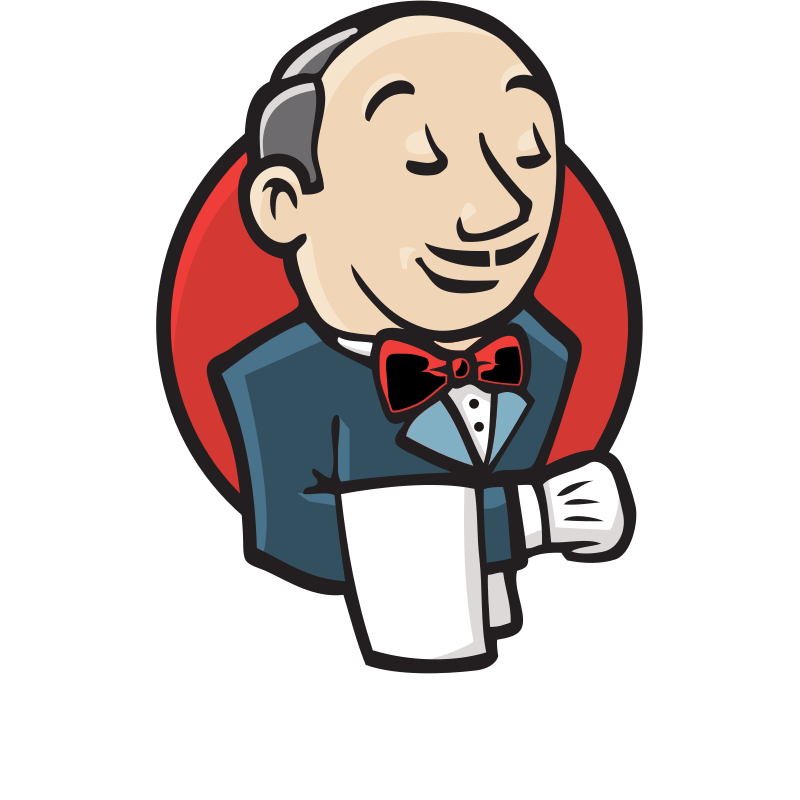

<!--
- 🌱 I’m currently learning ...
- 🤝 I’m looking to collaborate on ...
- 🤔 I’m looking for help with ...
- 💬 Ask me about ...
- 📫 How to reach me: ...
- ✉️ You can contact me at ...
- 😄 Pronouns: ...
- ⚡ Fun fact: ...
- 🖥️ ...
-->

Hi 👋 My name is Victoria
================================================================================================================================

QA Engineer | CTFL-AT | CTAL-TAE
-----------------------------------------

Working with QA since 2018, focusing on test automation for various clients and products, from Back to Front End, Web to Mobile, both native and hybrid, and data quality, doing functional and non-functional tests. Graduated as a Technologist in Games Development in 2016, and Computer Technician in 2012.

* 🌍  I'm based in São Paulo, Brazil
* 💬  Check my [pronouns page](https://pronouns.page/@Vic_Walker) for multilingual references
* 🗣️  I speak Portuguese, English, Spanish, and a little of French
* 🎮  See my game portfolio at [itch.io](http://vicwalker.itch.io)
* 📫  You can reach me at my socials below (for faster response, use Bluesky)
* 🧠  Learning about AT Protocol, and Azure
* ⭐  Virtual, Augmented, and Mixed Realities are really cool
* 🌐  Big fan of the decentralized internet
* ⚡  I like to keep up with new technology
* 🤝  I'm open to collaborating on Open Source Projects

## Skills
### Programming Languages

<a href="https://www.oracle.com/java/" target="_blank" rel="noreferrer">
<picture>
<source media="(prefers-color-scheme: dark)" srcset="./icons/skills/java-colored.svg" />
<source media="(prefers-color-scheme: light)" srcset="./icons/skills/java-colored.svg" />

</picture></a>
<a href="https://www.python.org/" target="_blank" rel="noreferrer">
<picture>
<source media="(prefers-color-scheme: dark)" srcset="./icons/skills/python-colored.svg" />
<source media="(prefers-color-scheme: light)" srcset="./icons/skills/python-colored.svg" />

</picture></a>
<a href="https://docs.microsoft.com/en-us/dotnet/csharp/" target="_blank" rel="noreferrer">
<picture>
<source media="(prefers-color-scheme: dark)" srcset="./icons/skills/csharp-colored.svg" />
<source media="(prefers-color-scheme: light)" srcset="./icons/skills/csharp-colored.svg" />

</picture></a>
<a href="https://developer.mozilla.org/en-US/docs/Web/JavaScript" target="_blank" rel="noreferrer">
<picture>
<source media="(prefers-color-scheme: dark)" srcset="./icons/skills/javascript-colored.svg" />
<source media="(prefers-color-scheme: light)" srcset="./icons/skills/javascript-colored.svg" />

</picture></a>
<a href="https://developer.mozilla.org/en-US/docs/Glossary/HTML5" target="_blank" rel="noreferrer">
<picture>
<source media="(prefers-color-scheme: dark)" srcset="./icons/skills/html5.svg" />
<source media="(prefers-color-scheme: light)" srcset="./icons/skills/html5.svg" />

</picture></a>

### Test Frameworks

<a href="https://www.karatelabs.io" target="_blank" rel="noreferrer">
<picture>
<source media="(prefers-color-scheme: dark)" srcset="./icons/skills/karate-labs-dark.png" />
<source media="(prefers-color-scheme: light)" srcset="./icons/skills/karate-labs.png" />

</picture></a>
<a href="https://cucumber.io" target="_blank" rel="noreferrer">
<picture>
<source media="(prefers-color-scheme: dark)" srcset="./icons/skills/cucumber-colored.svg" />
<source media="(prefers-color-scheme: light)" srcset="./icons/skills/cucumber-colored.svg" />

</picture></a>
</picture></a>
<a href="https://rest-assured.io" target="_blank" rel="noreferrer">
<picture>
<source media="(prefers-color-scheme: dark)" srcset="./icons/skills/rest-assured-dark.png" />
<source media="(prefers-color-scheme: light)" srcset="./icons/skills/rest-assured.png" />

</picture></a>
<a href="https://docs.pytest.org/en/stable/" target="_blank" rel="noreferrer">
<picture>
<source media="(prefers-color-scheme: dark)" srcset="./icons/skills/pytest.svg" />
<source media="(prefers-color-scheme: light)" srcset="./icons/skills/pytest.svg" />

</picture></a>
<a href="https://pandas.pydata.org" target="_blank" rel="noreferrer">
<picture>
<source media="(prefers-color-scheme: dark)" srcset="./icons/skills/pandas-dark.svg" />
<source media="(prefers-color-scheme: light)" srcset="./icons/skills/pandas-colored.svg" />

</picture></a>
<a href="https://specflow.org" target="_blank" rel="noreferrer">
<picture>
<source media="(prefers-color-scheme: dark)" srcset="./icons/skills/specflow.png" />
<source media="(prefers-color-scheme: light)" srcset="./icons/skills/specflow.png" />

</picture></a>
<a href="https://robotframework.org/" target="_blank" rel="noreferrer">
<picture>
<source media="(prefers-color-scheme: dark)" srcset="./icons/skills/robotframework.svg" />
<source media="(prefers-color-scheme: light)" srcset="./icons/skills/robotframework.svg" />

</picture></a>
<a href="https://www.cypress.io/" target="_blank" rel="noreferrer">
<picture>
<source media="(prefers-color-scheme: dark)" srcset="./icons/skills/cypress-dark.svg" />
<source media="(prefers-color-scheme: light)" srcset="./icons/skills/cypress.svg" />

</picture></a>

### Test Tools

<a href="https://www.selenium.dev" target="_blank" rel="noreferrer">
<picture>
<source media="(prefers-color-scheme: dark)" srcset="./icons/skills/selenium-colored.svg" />
<source media="(prefers-color-scheme: light)" srcset="./icons/skills/selenium-colored.svg" />

</picture></a>
<a href="https://appium.io/docs/en/latest/" target="_blank" rel="noreferrer">
<picture>
<source media="(prefers-color-scheme: dark)" srcset="./icons/skills/appium-colored.svg" />
<source media="(prefers-color-scheme: light)" srcset="./icons/skills/appium-colored.svg" />

</picture></a>
<a href="https://jmeter.apache.org/" target="_blank" rel="noreferrer">
<picture>
<source media="(prefers-color-scheme: dark)" srcset="./icons/skills/jmeter-dark.svg" />
<source media="(prefers-color-scheme: light)" srcset="./icons/skills/jmeter.svg" />

</picture></a>
<a href="https://www.postman.com/" target="_blank" rel="noreferrer">
<picture>
<source media="(prefers-color-scheme: dark)" srcset="./icons/skills/postman.svg" />
<source media="(prefers-color-scheme: light)" srcset="./icons/skills/postman.svg" />

</picture></a>
<a href="https://insomnia.rest/" target="_blank" rel="noreferrer">
<picture>
<source media="(prefers-color-scheme: dark)" srcset="./icons/skills/insomnia.svg" />
<source media="(prefers-color-scheme: light)" srcset="./icons/skills/insomnia.svg" />

</picture></a>

### CI/CD Workflows and Pipelines

<a href="https://aws.amazon.com" target="_blank" rel="noreferrer">
<picture>
<source media="(prefers-color-scheme: dark)" srcset="./icons/skills/aws-dark.svg" />
<source media="(prefers-color-scheme: light)" srcset="./icons/skills/aws-colored.svg" />

</picture></a>
<a href="https://github.com/features/actions" target="_blank" rel="noreferrer">
<picture>
<source media="(prefers-color-scheme: dark)" srcset="./icons/skills/githubactions-dark.svg" />
<source media="(prefers-color-scheme: light)" srcset="./icons/skills/githubactions.svg" />

</picture></a>
<a href="https://www.jenkins.io/" target="_blank" rel="noreferrer">
<picture>
<source media="(prefers-color-scheme: dark)" srcset="./icons/skills/jenkins-dark.svg" />
<source media="(prefers-color-scheme: light)" srcset="./icons/skills/jenkins.svg" />

</picture></a>

### Dev Tools

<a href="https://maven.apache.org" target="_blank" rel="noreferrer">
<picture>
<source media="(prefers-color-scheme: dark)" srcset="./icons/skills/maven-dark.svg" />
<source media="(prefers-color-scheme: light)" srcset="./icons/skills/maven-colored.svg" />

</picture></a>
<a href="https://nodejs.org/en/" target="_blank" rel="noreferrer">
<picture>
<source media="(prefers-color-scheme: dark)" srcset="./icons/skills/nodejs-colored.svg" />
<source media="(prefers-color-scheme: light)" srcset="./icons/skills/nodejs-colored.svg" />

</picture></a>

### Databases

<a href="https://www.mysql.com/" target="_blank" rel="noreferrer">
<picture>
<source media="(prefers-color-scheme: dark)" srcset="./icons/skills/mysql-colored.svg" />
<source media="(prefers-color-scheme: light)" srcset="./icons/skills/mysql-colored.svg" />

</picture></a>
<a href="https://aws.amazon.com/dynamodb/" target="_blank" rel="noreferrer">
<picture>
<source media="(prefers-color-scheme: dark)" srcset="./icons/skills/aws-dynamodb.svg" />
<source media="(prefers-color-scheme: light)" srcset="./icons/skills/aws-dynamodb.svg" />

</picture></a>
<a href="https://www.mongodb.com/" target="_blank" rel="noreferrer">
<picture>
<source media="(prefers-color-scheme: dark)" srcset="./icons/skills/mongodb.svg" />
<source media="(prefers-color-scheme: light)" srcset="./icons/skills/mongodb.svg" />

</picture></a>

## Socials

<a href="https://www.linkedin.com/in/victoriamoliveira" target="_blank" rel="noreferrer">
<picture>
<source media="(prefers-color-scheme: dark)" srcset="./icons/socials/linkedin-dark.svg" />
<source media="(prefers-color-scheme: light)" srcset="./icons/socials/linkedin.svg" />

</picture></a>
<a href="https://bsky.app/profile/vicwalker.bsky.social" target="_blank" rel="noreferrer">
<picture>
<source media="(prefers-color-scheme: dark)" srcset="./icons/socials/bluesky-social-dark.svg" />
<source media="(prefers-color-scheme: light)" srcset="./icons/socials/bluesky-social.svg" />

</picture></a>

## Profile Status

 

